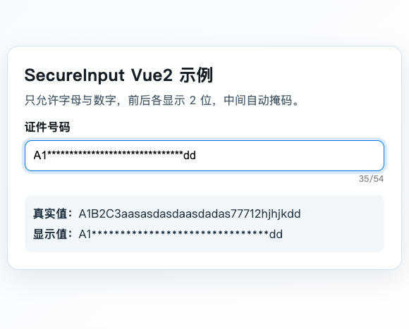

# SecureInput（支持 Vue3.x / Vue2.x）

`SecureInput` 是一个安全输入组件，只允许输入数字和英文字母。  
显示规则：前两位和后两位明文，中间位使用 `*` 掩码。

示例：

- 输入 `123456` 显示 `12**56`
- 输入 `1234567` 显示 `12***67`
- 输入 `12345678` 显示 `12****78`



组件支持实时更新、光标自由移动、任意位置删除和粘贴（自动过滤非法字符）。

## 功能特性

- 仅允许 `0-9`、`a-z`、`A-Z`
- 掩码实时更新（长度与真实值一致）
- 支持中间位置插入/删除/替换
- 支持 `maxlength` 限制（按真实值长度）
- 可选显示输入计数（`displayNum`）
- 同时兼容 Vue3 / Vue2

## 安装

```bash
npm install @wintelsui/secure-input
```

## Vue3 用法

```js
import { createApp } from "vue";
import App from "./App.vue";
import Vue3Plugin from "@wintelsui/secure-input/vue3";

const app = createApp(App);
app.use(Vue3Plugin);
app.mount("#app");
```

```vue
<template>
  <SecureInput v-model="idCard" :maxlength="18" display-num />
</template>

<script setup>
import { ref } from "vue";

const idCard = ref("");
</script>
```

## Vue2 用法

```js
import Vue from "vue";
import App from "./App.vue";
import SecureInput from "@wintelsui/secure-input/vue2";

Vue.use(SecureInput);

new Vue({
  render: (h) => h(App),
}).$mount("#app");
```

```vue
<template>
  <SecureInput v-model="idCard" :maxlength="18" display-num />
</template>

<script>
export default {
  data() {
    return {
      idCard: "",
    };
  },
};
</script>
```

## API

### Props

- `modelValue?: string` Vue3 `v-model`
- `value?: string` Vue2 兼容值
- `maxlength?: number | string` 最大真实长度
- `displayNum?: boolean` 是否显示右下角计数
- `encrypt?: boolean` 是否启用脱敏显示，默认 `true`
- `revealHead?: number` 前缀明文长度，默认 `2`
- `revealTail?: number` 后缀明文长度，默认 `2`
- `maskChar?: string` 掩码字符，默认 `*`
- `disabled?: boolean`
- `readonly?: boolean`

### Events

- `update:modelValue`（Vue3）
- `input`
- `change`
- `focus`
- `blur`

## 开发与测试

```bash
npm test
```

## 许可证

[MIT](LICENSE) - Copyright (c) 2026 wintelsui
